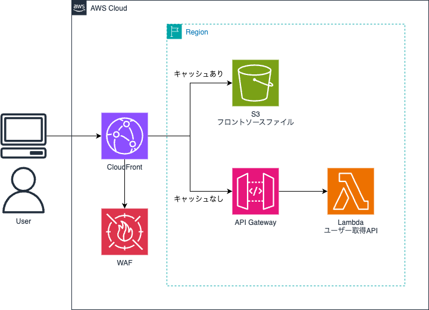

# CloudFront & S3 & API Gateway & WAF サンプル

## 構成

[]

## 初期設定

- ルートディレクトリで`npm ci`を実行する
- cdkディレクトリで`npm ci`を実行する
- frontendディレクトリで`npm ci`を実行する

## ローカル実行

- front/.env.templateをコピーしてfront/.envを作成する
  - `VITE_API_ENDPOINT`に`http://localhost:3000`を設定する
- ルートディレクトリで `npm run start-front:local` でフロントエンドを起動する
- ルートディレクトリで `npm run start-api:local` でAPIを起動する
  - ※Lambdaを修正した場合は、再度実行する必要がある、CDKの場合にsam buildコマンドなどでの自動反映方法が不明のため
- 動作確認
  - `http://localhost:5173`でアクセスする
  - 取得ボタンをクリックする

## デプロイ

- ルートディレクトリで `npm run deploy-all:dev` でデプロイ
- 動作確認
  - CloudFrontのURLでアクセスする
  - 取得ボタンをクリックする

## 削除

- ルートディレクトリで `npm run destroy-all:dev` で削除
- CloudWatch Logsにログが残っている場合は手動で削除する必要がある
